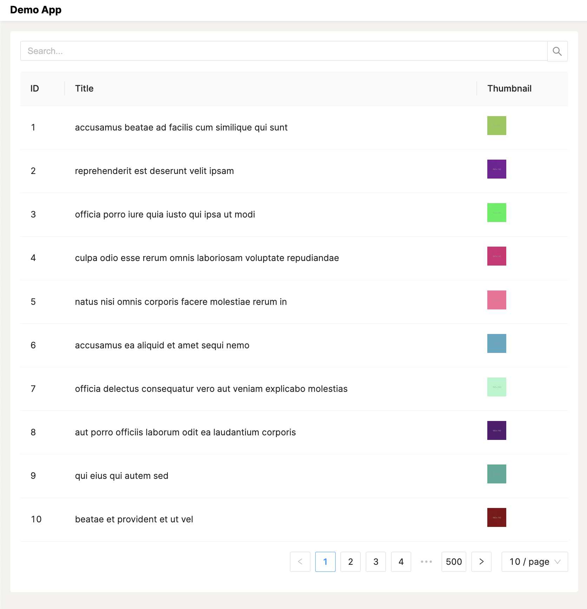
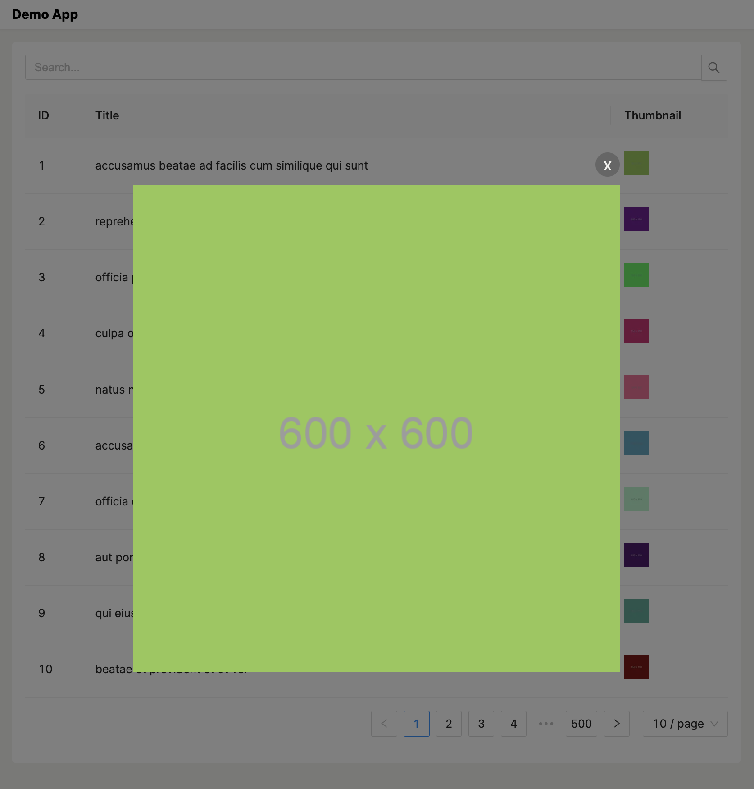
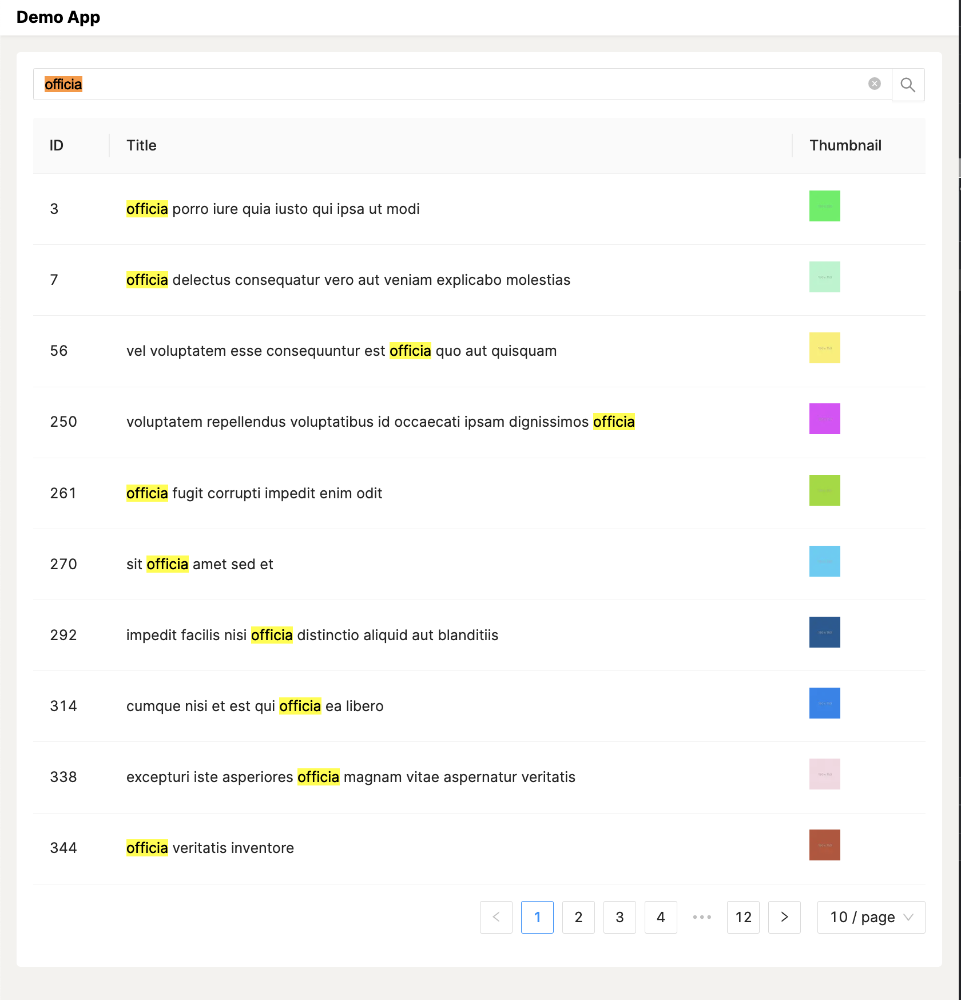

# Demo App


Build a search application that searches on a collection of photo data and display the result in a table format to a user.

## Preview

<table width="100%">
  <tr>
    <td width="40%">
      <strong>Main</strong>
      <p>Show list images from API: <a href="https://graphqlzero.almansi.me/api">graphqlzero.almansi.me/api</a> </p>
    </td>
    <td width="60%">
      
    </td>
  </tr>
  <tr>
    <td width="40%">
      <strong>Preview</strong>
      <p>Show detail popup with original ratio</p>
    </td>
    <td width="60%">
      
    </td>
  </tr>
  <tr>
    <td width="40%">
      <strong>Search</strong>
      <p>Find images by keyword</p>
    </td>
    <td width="60%">
      
    </td>
  </tr>
</table>

## Stacks

<table>
  <tr>
  <td width="30%">
   <strong>SPA</strong>
  </td>
  <td width="50%">
   react.js (NextJS)
  </td>
  </tr>
  <tr>
  <td width="30%">
   <strong>Query Language</strong>
  </td>
  <td width="70%">
   GraphQL (graphql-request, @tanstack/react-query)
  </td>
  </tr>
  <tr>
  <td width="30%">
   <strong>React UI library</strong>
  </td>
  <td width="70%">
   Antd (table, flexible import styles)
  </td>
  </tr>
  <tr>
  <td width="30%">
   <strong>Lint</strong>
  </td>
  <td width="70%">
   eclint, eslint, prettier
  </td>
  </tr>
  <tr>
  <td width="30%">
   <strong>Registry</strong>
  </td>
  <td width="70%">
   docker, docker compose
  </td>
  </tr>
  <tr>
  <td width="30%">
   <strong>Process manager</strong>
  </td>
  <td width="70%">
   pm2
  </td>
  </tr>
  <tr>
  <td width="30%">
   <strong>CI/CD</strong>
  </td>
  <td width="70%">
   github action
  </td>
  </tr>
  <tr>
  <td width="30%">
   <strong>Git</strong>
  </td>
  <td width="70%">
   hooks (husky)
  </td>
  </tr>
  <tr>
  <td width="30%">
   <strong>Cloud</strong>
  </td>
  <td width="70%">
   AWS (ECR, ECS, Load Balancer, IAM)
  </td>
  </tr>
</table>

## Development

First, run the development server:

```bash
npm run dev
# or
yarn dev
# or
pnpm dev
```

Open [http://localhost:3000](http://localhost:3000) with your browser to see the result.

## Run production mode with registry (docker)

Start in the first time

```
cd .docker

sh compose.sh
```

Start if the container exist

```
docker start demo-app
```

Open [http://localhost:4000](http://localhost:4000) with your browser to see the result.
